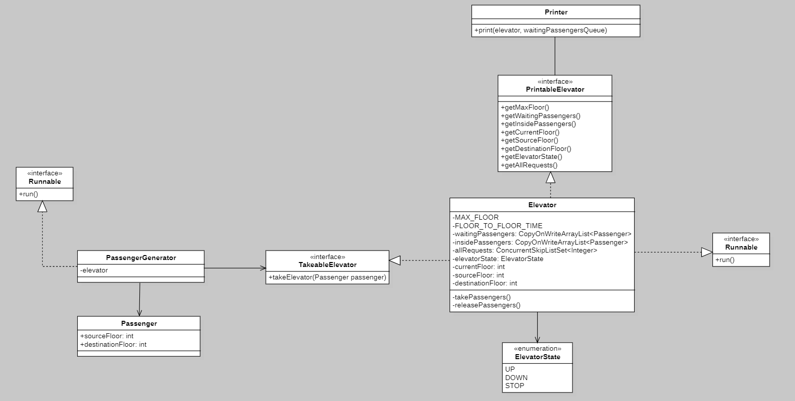

# Elevator Simulator

## General
Simple Java console program that simulates the working of an elevator in a building. The program is parameterized with positional arguments:
```
F  number of floors in the building,
t  unit of simulation time, i.e. the time in seconds needed to move one floor by the elevator
p  the probability of a passenger appearing in unit t on a random floor with the intention of traveling to random floor
```

The program graphically visualizes the state of the entire system every unit of time *t*, i.e. the location of the elevator, current source and destination floors, the elevator condition, the number of passengers inside, passengers waiting on each floor.

## Elevator algorithm and architecture

### Elevator algorithm
- no requests => elevator stay at the current floor
- elevator move in one chosen direction from src to dest
- if the request is on src->dest track, elevator stops and service it (take/release passengers)
- request is send when passenger takes elevator (src) or go inside elevator (dest)
<br /><br />

### Architecture



## Run
1. Make sure you have installed JDK
```
javac -version
```
2. Clone the repository and compile all .java files
```
git clone https://github.com/ksalekk/elevator-simulator.git
cd ./elevator-simulator
javac -d bins ./src/edu/ksalekk/elevatorsimulator/*.java
cd ./bins
```
3. Run test program with specified parameters (remember not to type .class extension)
```
java edu/ksalekk/elevatorsimulator/ElevatorSimulatorTest 5 2 0.3
```

You can also run the program in your IDE.
